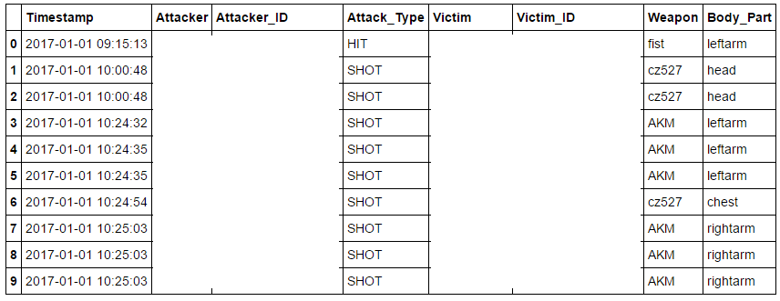
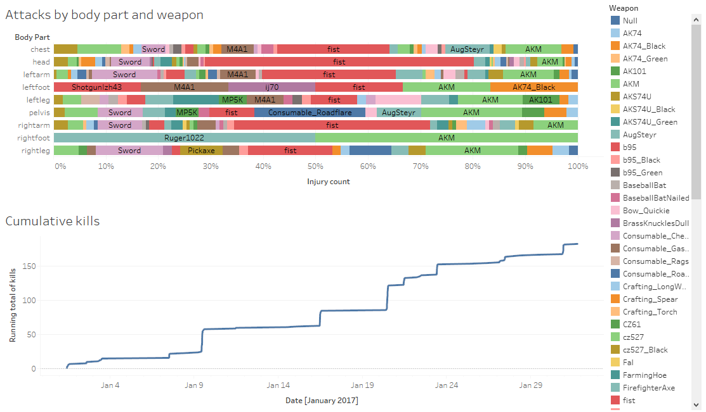

# DayZ Log File Parser
Extracts injury and kill data from DayZ .ADM/.clog log files. 

**Requirements:** [Pandas](http://pandas.pydata.org/) (pip install pandas). Works on Python 2 and 3.

**Usage:** python attack_parser.py *name_of_log.clog*

**Output:**

* injuries_name_of_log.csv: A timestamped list of player-on-player violence.
  * Timestamp: dd/mm/yyyy hh:mm:ss (someone please let me know if it picks up your local date format)
  * Attacker/Victim: Player tag. May be duplicate with other players.
  * Attacker_ID/Victim_ID: Steam64 player ID. Guaranteed to refer to a unique player.
  * Attack_Type: SHOT with a projectile or HIT with a melee weapon.
  * Weapon: the naughty thing
  * Body_Part: the impact area. (Can someone clarify whether there's a difference between RightArm and rightarm, e.g. upper and lower?)
* kills_name_of_log.csv: A timestamped list of player-caused kills. 
  * Timestamp: dd/mm/yyyy hh:mm:ss
  * Killer/Killer_ID/Victim/Victim_ID: as above
  * Kill type: 'Direct' or 'Blood loss' (see discussion below)
  * Elapsed time: For 'Blood loss' deaths, number of seconds between the killer last injuring the victim, and their eventual death due to blood loss. Always zero for direct kills.

Example:

**Discussion:**

My innovation over other log parsers is to detect when a player dies by blood loss, and guesstimate whether that blood loss was due to another player. With direct kills (e.g. headshots) you get a log line like:

    Player "Alice"(id=76561190000000001) has been killed by player "Bob"(id=76561190000000002)
    
But if Bob causes Alice to bleed out, you'll only get this:

    "Alice(uid=76561190000000001) DIED Blood <= 0"
    
So after Bob injures Alice, the script starts a timer. If Alice dies of blood loss within 300 seconds, Bob gets credit for the kill. (This is a trade-off because she might take longer than 300 seconds to die, though this is unusual, and also increases the risk of crediting Bob for a kill when Alice escapes but is attacked and killed by a zombie instead.)

I also de-duplicate multiple references to the same injury. DayZ seems to log high-damage injuries over multiple lines as shock/blood damage is applied (usually one line per 500 damage).

Please let me know if you find this useful or would like to extract other intelligence from your server log files.

**Goals:**

* Fine-tune blood loss death detection.
* Add support for crediting all involved parties on a kill, or for crediting kill assists.
* Add support for simultaneous player count, players session length etc.
* Add support for grouping multiple injuries into a single engagement (use case: awarding points for causing injuries, without awarding more points for rapid fire versus bolt-action weapons).
* Attribute weapons to kills, not just injuries.
* Graphs, webservice, etc (volunteers wanted!):

**Acknowledgements:** Regex code from [C222/DayZ-Obituaries](https://github.com/C222/DayZ-Obituaries/)
